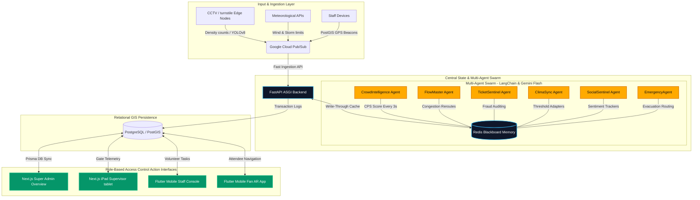

# 🏟️ StadiumOS
### AI-Agent Powered Adaptive Stadium Intelligence Platform

> **Target Event:** Build with AI – Agentic Premier League  
> **Classification:** Smart Infrastructure • Crowd Intelligence • Multi-Agent Systems  
> **Repository Tier:** Enterprise Production-Grade  

---

## 🔮 System Architecture & Spatial Data Loops

StadiumOS uses an event-driven, high-concurrency architecture that decouples spatial processing from the visual render loops. Sensor streams and computer vision edge nodes feed into a centralized Blackboard memory cache, which is continuously audited by a collaborative swarm of autonomous AI agents.



---

## 🔐 4 Distinct Operational Roles

StadiumOS operates on a rigorous Role-Based Access Control (RBAC) architecture, delivering custom-tailored capabilities across four distinct venue interfaces:

| Role | Access Level | Primary Interface | Swarm Core Interaction |
|---|---|---|---|
| **1. Super Admin / CC Operator** | Global (Full System) | Next.js Desktop Dashboard | Monitors global 3D stand twin, agent decision ledgers, inputs NLP OpsCommander overrides, and triggers environmental simulations. |
| **2. Zone Sector Supervisor** | Regional (Restricted Stand) | iPad/Tablet command view (`/supervisor`) | Approves Human-in-the-Loop (HITL) agent dispatches, reviews local turnstile capacity, and resolves escalated volunteer alerts. |
| **3. Field Volunteer / Responder** | Localized (Task-based) | Flutter Mobile App (Staff Mode) | Constantly pings background GPS locations to PostGIS, executes proximity-based emergency dispatches, and checks offline SQLite scanners. |
| **4. General Fan / Attendee** | Personal (Ticket Scope) | Flutter Mobile App (Fan Mode) | Authenticates via QR scan, slides up personalized weather concierge cards, locates seats in 3D, and navigates via live AR detour arrows. |

---

## 🔮 Key Visual & Agentic Innovations

### 1. 3D Seating Stand Digital Twin
- **Command & Mobile locator**: Embedded a high-performance 3D perspective seating stand (12 cols × 8 rows) rendered on custom HTML5 Canvas on both Web and Mobile.
- **WebSocket-Driven Aisle Glow**: Walkway grids dynamically shift color in real time based on active sector CPS: Green (Safe), Yellow (Caution), Orange (Warning), Red (Critical).
- **Camera Swoop transitions**: Clicking any seat on the grid triggers a smooth cubic camera swoop, rotating and pitching the viewport close-up on the targeted seat.

### 2. "Agentic Onboarding" QR Scanner
- **Onboarding Interface**: Built a futuristic camera QR code validation portal on the mobile login page with a pulsing laser scanning line.
- **AI Concierge greeting**: Scanning ticket data triggers a personalized sliding modal welcoming "Deepak" by name, cross-referencing meteorological feeds, and offering immediate path choices.

### 3. Live AR "Ghost Route" Guide (3-Stage Fallback)
Projects floating, neon blue AR direction paths looping a pre-recorded hallway navigation walk:
1. **Stage 1 (Local Asset)**: Loops a pre-recorded walk (`assets/videos/hallway.mp4`).
2. **Stage 2 (Network Stream)**: Streams a high-speed walk loop from a public CDN (`mixkit.co`).
3. **Stage 3 (3D Wireframe Tunnel — 100% Offline)**: If completely disconnected, automatically engages an animated local 3D scrolling vector corridor.
* **WebSocket Rerouting**: Real-time crowd surges trigger two intense phone vibration pulses, rotating the AR arrow **90° to the Right** to detour the attendee dynamically.

---

## 🗄️ Database Architecture (PostgreSQL / PostGIS & SQLite)

StadiumOS relies on PostgreSQL + PostGIS to perform spatial queries, using **Prisma ORM** in production, alongside localized edge turnstiles running **SQLite Offline Replication** during complete network drops.

*For detailed GeoJSON matrices, database tables, and privacy-first YOLOv8 standards, review **[stadiumos_architecture_spec.md](file:///c:/Users/deepa/Desktop/stadiumos/stadiumos_architecture_spec.md)**.*

---

## 🚀 Quick Start (Local Demo Setup)

Ensure you have Python 3.11+, Node.js 20+, and Flutter SDK installed.

### 1. Backend server Setup
```bash
cd backend
python -m venv .venv
.venv\Scripts\activate      # On Windows
pip install -r requirements.txt
uvicorn main:app --reload --port 8000
```

### 2. Next.js Command Center Setup
```bash
cd admin
npm install
npm run dev
# Dashboard is live at http://localhost:3000
# Supervisor tablet dashboard at http://localhost:3000/supervisor
```

### 3. Flutter Fan App Setup
```bash
cd fan-app
flutter pub get
flutter run
```

---

## 🎭 Live Pitch Demonstration Guide

To execute a flawless presentation for the judges showing collective venue intelligence, follow the step-by-step script inside **[walkthrough.md](file:///C:/Users/deepa/.gemini/antigravity/brain/8f84db49-39ee-4474-96f3-92a442e37e03/walkthrough.md)**.
