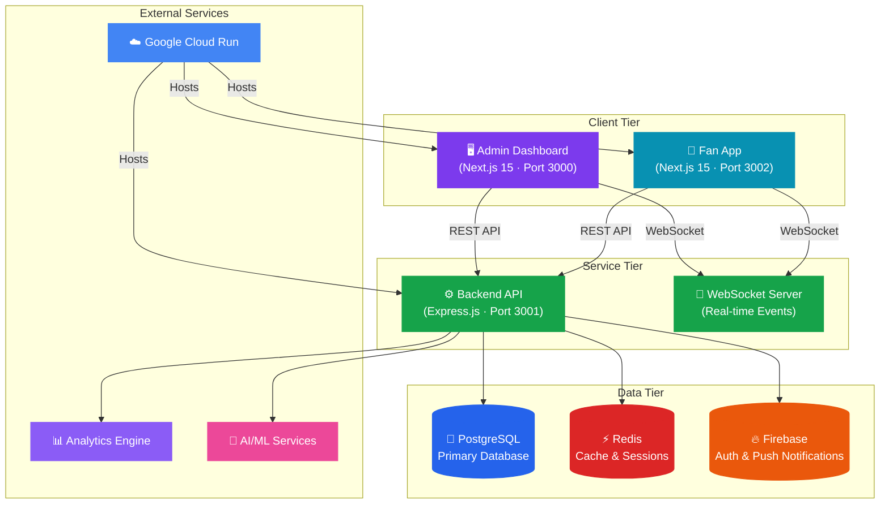
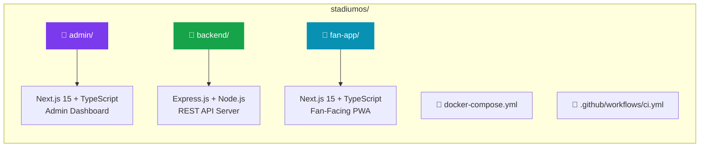
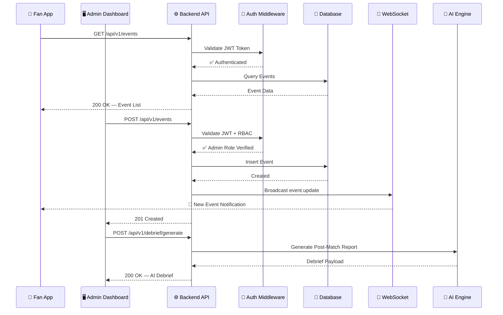
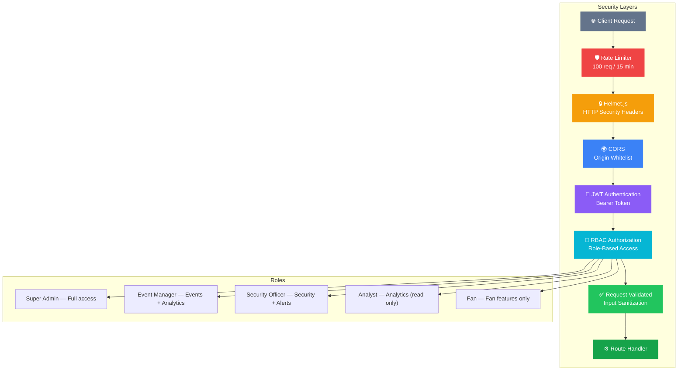
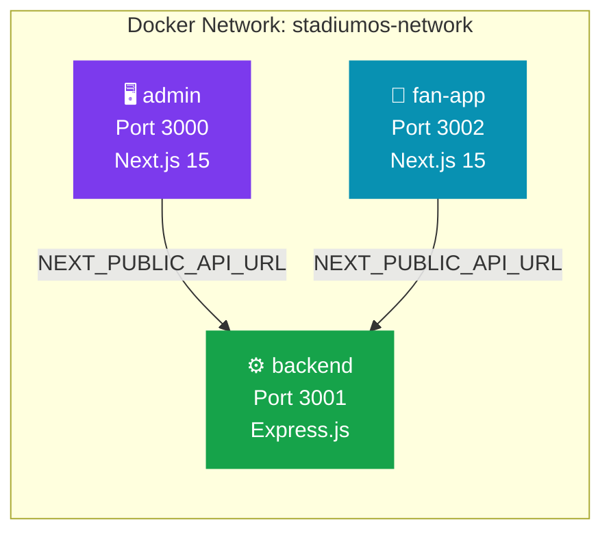
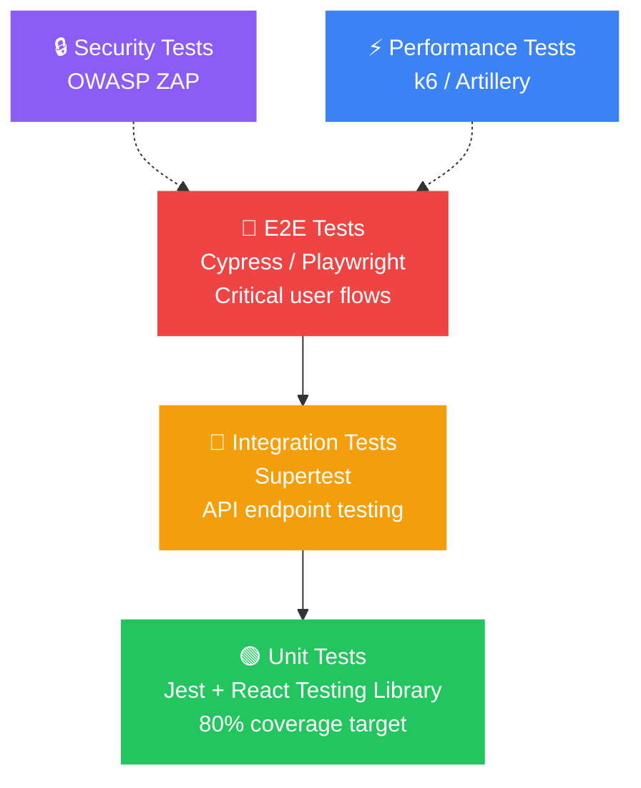
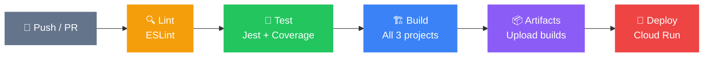

<p align="center">
  
</p>

<h1 align="center">🏟️ StadiumOS</h1>

<p align="center">
  <strong>AI-Powered Stadium Management Platform</strong><br/>
  <em>Revolutionizing stadium operations with intelligent management, real-time analytics, and immersive fan experiences.</em>
</p>

<p align="center">
  
  
  
  
  
  
  
  
</p>

<p align="center">
  <a href="#-quick-start">Quick Start</a> •
  <a href="#-architecture">Architecture</a> •
  <a href="#-features">Features</a> •
  <a href="#-api-reference">API Reference</a> •
  <a href="#-deployment">Deployment</a> •
  <a href="#-contributing">Contributing</a>
</p>

---

## 📖 Overview

**StadiumOS** is a comprehensive, AI-driven stadium management platform designed to seamlessly connect stadium operators with fans. It provides a unified ecosystem for event management, security operations, fan engagement, and real-time analytics — all powered by intelligent automation and predictive insights.

Built for the **Agentic Premier League** hackathon, StadiumOS demonstrates how modern AI and cloud technologies can transform the stadium experience for operators, security teams, and spectators alike.

| Metric Target | Value |
|:---|:---|
| API Response Time | < 200ms |
| Uptime SLA | 99.9% |
| Concurrent Users | 100,000+ |
| Security Response Improvement | 30% faster |
| Fan Engagement Lift | 25% increase |

---

## 🏗️ Architecture

### High-Level System Architecture



### Monorepo Structure



### Request Flow & Data Architecture



### Security Architecture



---

## ✨ Features

### 🖥️ Admin Dashboard

| Module | Capabilities |
|:---|:---|
| **📊 Dashboard** | Real-time KPIs (attendance, revenue, alerts, fan satisfaction), SVG-based revenue charts, recent events table, quick action shortcuts |
| **🎪 Events** | Full CRUD lifecycle, capacity management, status tracking (Upcoming / On Sale / Sold Out), search & filter |
| **🔒 Security** | Live threat-level indicator, 6-camera surveillance grid, active alert panel with severity levels, zone security map, personnel deployment |
| **📈 Analytics** | Revenue breakdown (Tickets / Concessions / Merchandise / Sponsorship), attendance trends, demographic insights, top-performing events |
| **👥 Users** | Role management (Super Admin, Event Manager, Security, Analyst), status monitoring, invite & suspend controls |
| **⚙️ Settings** | Tabbed config (General, Notifications, Security, Integrations), 2FA toggle, session management, API key management |
| **🤖 AI Debrief** | Post-match report generation with executive summary, sentiment analysis, security assessment, and actionable recommendations |

### 📱 Fan App

| Module | Capabilities |
|:---|:---|
| **🏠 Home** | Hero section with live ticker, featured event carousel, quick-access grid, animated stats counters, testimonials |
| **🎫 Events** | Category browsing (Sports / Concerts / Festivals / E-Sports), search, sort by date/price/popularity |
| **🎟️ Tickets** | Digital wallet with QR codes, seat & gate info, upcoming/past tabs, Apple/Google Wallet integration |
| **🏟️ Fan Zone** | Live chat, interactive polls, prediction games, engagement leaderboard, social feed with emoji reactions |
| **🍔 Food & Drinks** | Menu browsing with dietary tags, cart system, seat delivery, real-time order tracking |
| **🗺️ AR Navigation** | SVG venue map, location markers (gates, restrooms, first aid), accessibility routes, AR view placeholder |
| **⭐ Loyalty** | Points dashboard, tier system (Bronze → Platinum), rewards catalog, points history, referral program |

### ⚙️ Backend API

| Capability | Details |
|:---|:---|
| **RESTful Design** | Versioned API (`/api/v1/`) with 40+ endpoints across 7 resource domains |
| **Authentication** | JWT-based with Bearer tokens, refresh token support |
| **Authorization** | Role-based access control (RBAC) with 5 roles |
| **Real-Time** | WebSocket server for live events (`security.alert`, `event.update`, `crowd.density`) |
| **AI Integration** | Post-match debrief generation with ML-powered insights |
| **Security** | Helmet, CORS, rate limiting (100 req/15min), input validation |
| **Observability** | Morgan HTTP logging, structured error responses, health check endpoint |

---

## 📂 Project Structure

```
stadiumos/
├── admin/                          # 🖥️ Admin Dashboard (Next.js 15)
│   ├── src/app/
│   │   ├── dashboard/              # Main dashboard with KPIs
│   │   ├── events/                 # Event management
│   │   ├── security/               # Security & surveillance
│   │   ├── analytics/              # Analytics & reporting
│   │   ├── users/                  # User management
│   │   ├── settings/               # System settings
│   │   ├── login/                  # Admin authentication
│   │   ├── profile/                # Admin profile
│   │   └── components/             # Sidebar, Header, Footer
│   ├── public/                     # Static assets
│   ├── package.json
│   └── next.config.ts
│
├── backend/                        # ⚙️ API Server (Express.js)
│   ├── src/
│   │   ├── server.js               # Entry point + middleware stack
│   │   ├── routes/
│   │   │   ├── events.js           # Event CRUD + analytics
│   │   │   ├── security.js         # Alerts, cameras, zones
│   │   │   ├── analytics.js        # Dashboard, revenue, predictions
│   │   │   ├── users.js            # Auth, profile, role management
│   │   │   ├── fans.js             # Loyalty, tickets, food, polls
│   │   │   ├── notifications.js    # Push notifications & preferences
│   │   │   └── health.js           # Health check
│   │   └── middleware/
│   │       ├── auth.js             # JWT verification
│   │       ├── errorHandler.js     # Global error handling
│   │       └── validator.js        # Request validation
│   ├── Dockerfile
│   └── package.json
│
├── fan-app/                        # 📱 Fan Application (Next.js 15)
│   ├── src/app/
│   │   ├── events/                 # Event browsing
│   │   ├── tickets/                # Digital ticket wallet
│   │   ├── fan-zone/               # Social features & polls
│   │   ├── food-drinks/            # F&B ordering
│   │   ├── ar-navigation/          # AR venue navigation
│   │   ├── loyalty/                # Rewards program
│   │   ├── login/                  # Fan authentication
│   │   ├── profile/                # Fan profile
│   │   └── components/             # Navbar, Footer
│   ├── public/                     # Static assets
│   ├── package.json
│   └── next.config.ts
│
├── docker-compose.yml              # 🐳 Multi-service orchestration
├── .github/workflows/ci.yml        # 🔄 CI/CD pipeline
├── .env.example                    # 🔑 Environment variable template
├── CONTRIBUTING.md                 # 🤝 Contribution guidelines
├── stadiumos_architecture_spec.md  # 📐 Architecture specification
├── stadiumos_testing_architecture.md # 🧪 Testing strategy
├── stadiumosprd.md                 # 📋 Product Requirements Document
└── post_match_debrief.md           # 🤖 AI Debrief feature spec
```

---

## 🚀 Quick Start

### Prerequisites

| Tool | Version | Purpose |
|:---|:---|:---|
| **Node.js** | ≥ 18.x | JavaScript runtime |
| **npm** | ≥ 9.x | Package manager |
| **Docker** | ≥ 20.x | Containerization (optional) |
| **Git** | ≥ 2.x | Version control |

### Option 1 — Local Development (Recommended)

```bash
# 1. Clone the repository
git clone https://github.com/dayanandXdarpan/stadiumos.git
cd stadiumos

# 2. Set up environment variables
cp .env.example .env
# Edit .env with your configuration

# 3. Install dependencies for all services
cd backend && npm install && cd ..
cd admin && npm install && cd ..
cd fan-app && npm install && cd ..

# 4. Start the backend API
cd backend
npm run dev
# → Server running at http://localhost:3001

# 5. Start the admin dashboard (new terminal)
cd admin
npm run dev
# → Dashboard at http://localhost:3000

# 6. Start the fan app (new terminal)
cd fan-app
npm run dev
# → Fan App at http://localhost:3002
```

### Option 2 — Docker Compose

```bash
# Start all services with a single command
docker-compose up --build

# Services will be available at:
# Admin Dashboard → http://localhost:3000
# Backend API     → http://localhost:3001
# Fan App         → http://localhost:3002
```

### Default Credentials

| Role | Email | Password |
|:---|:---|:---|
| Super Admin | `admin@stadiumos.com` | `admin123` |
| Event Manager | `manager@stadiumos.com` | `manager123` |

---

## 📡 API Reference

All endpoints are prefixed with `/api/v1`. Protected endpoints require `Authorization: Bearer <token>` header.

### Authentication

```http
POST /api/v1/users/login
Content-Type: application/json

{
  "email": "admin@stadiumos.com",
  "password": "admin123"
}

# Response → { "token": "mock-jwt-token-...", "user": { ... } }
```

### Endpoints Overview

<details>
<summary><strong>🎪 Events</strong> — <code>/api/v1/events</code></summary>

| Method | Endpoint | Auth | Description |
|:---|:---|:---:|:---|
| `GET` | `/` | ❌ | List events (query: `?status=`, `?category=`, `?search=`) |
| `GET` | `/:id` | ❌ | Get event by ID |
| `POST` | `/` | ✅ | Create new event |
| `PUT` | `/:id` | ✅ | Update event |
| `DELETE` | `/:id` | ✅ | Delete event |
| `GET` | `/:id/analytics` | ✅ | Event-specific analytics |
| `POST` | `/:id/publish` | ✅ | Publish/activate event |

</details>

<details>
<summary><strong>🔒 Security</strong> — <code>/api/v1/security</code></summary>

| Method | Endpoint | Auth | Description |
|:---|:---|:---:|:---|
| `GET` | `/status` | ❌ | Overall security status & threat level |
| `GET` | `/alerts` | ❌ | List alerts (query: `?severity=`, `?status=`) |
| `POST` | `/alerts` | ✅ | Create new alert |
| `PUT` | `/alerts/:id` | ✅ | Update/acknowledge alert |
| `GET` | `/cameras` | ❌ | List camera feeds |
| `GET` | `/zones` | ❌ | Security zone information |
| `POST` | `/incidents` | ✅ | Report security incident |

</details>

<details>
<summary><strong>📈 Analytics</strong> — <code>/api/v1/analytics</code></summary>

| Method | Endpoint | Auth | Description |
|:---|:---|:---:|:---|
| `GET` | `/dashboard` | ❌ | Dashboard KPIs summary |
| `GET` | `/revenue` | ❌ | Revenue breakdown + monthly trends |
| `GET` | `/attendance` | ❌ | Attendance data + trends |
| `GET` | `/demographics` | ❌ | Fan demographic data |
| `GET` | `/predictions` | ❌ | AI-powered predictive analytics |
| `POST` | `/reports` | ✅ | Generate custom report |

</details>

<details>
<summary><strong>👥 Users</strong> — <code>/api/v1/users</code></summary>

| Method | Endpoint | Auth | Description |
|:---|:---|:---:|:---|
| `POST` | `/login` | ❌ | User authentication |
| `POST` | `/register` | ❌ | New user registration |
| `GET` | `/profile` | ✅ | Get current user profile |
| `PUT` | `/profile` | ✅ | Update profile |
| `GET` | `/` | ✅ | List all users (admin only) |
| `PUT` | `/:id/role` | ✅ | Update user role (admin only) |
| `DELETE` | `/:id` | ✅ | Delete user (admin only) |

</details>

<details>
<summary><strong>📱 Fans</strong> — <code>/api/v1/fans</code></summary>

| Method | Endpoint | Auth | Description |
|:---|:---|:---:|:---|
| `GET` | `/profile` | ✅ | Fan profile |
| `PUT` | `/profile` | ✅ | Update fan profile |
| `GET` | `/loyalty` | ✅ | Loyalty status (points, tier, history) |
| `POST` | `/loyalty/redeem` | ✅ | Redeem loyalty points |
| `GET` | `/tickets` | ✅ | Fan's tickets |
| `GET` | `/feed` | ❌ | Fan zone social feed |
| `POST` | `/feed` | ✅ | Post to fan zone |
| `GET` | `/polls` | ❌ | Active polls |
| `POST` | `/polls/:id/vote` | ✅ | Vote on poll |
| `GET` | `/food-menu` | ❌ | Food & drinks menu |
| `POST` | `/food-order` | ✅ | Place food order |
| `GET` | `/food-order/:id` | ❌ | Track order status |

</details>

<details>
<summary><strong>🔔 Notifications</strong> — <code>/api/v1/notifications</code></summary>

| Method | Endpoint | Auth | Description |
|:---|:---|:---:|:---|
| `GET` | `/` | ✅ | Get user notifications |
| `PUT` | `/:id/read` | ✅ | Mark as read |
| `PUT` | `/read-all` | ✅ | Mark all as read |
| `POST` | `/subscribe` | ✅ | Subscribe to push notifications |
| `DELETE` | `/subscribe` | ✅ | Unsubscribe |
| `GET` | `/preferences` | ✅ | Notification preferences |
| `PUT` | `/preferences` | ✅ | Update preferences |

</details>

<details>
<summary><strong>🤖 AI Debrief</strong> — <code>/api/v1/debrief</code></summary>

| Method | Endpoint | Auth | Description |
|:---|:---|:---:|:---|
| `POST` | `/generate` | ✅ | Generate AI post-match debrief report |

</details>

<details>
<summary><strong>💚 Health</strong> — <code>/api/v1/health</code></summary>

| Method | Endpoint | Auth | Description |
|:---|:---|:---:|:---|
| `GET` | `/` | ❌ | Health check (status, version, uptime) |

</details>

---

## 🐳 Docker & Deployment

### Docker Compose Architecture



### Google Cloud Run Deployment

StadiumOS is designed for production deployment on **Google Cloud Run** with the following configuration:

```bash
# Deploy backend
gcloud run deploy stadiumos-backend \
  --source ./backend \
  --port 3001 \
  --allow-unauthenticated \
  --set-env-vars "NODE_ENV=production"

# Deploy admin dashboard
gcloud run deploy stadiumos-admin \
  --source ./admin \
  --port 3000 \
  --set-env-vars "NEXT_PUBLIC_API_URL=https://stadiumos-backend-xxxxx.run.app"

# Deploy fan app
gcloud run deploy stadiumos-fan-app \
  --source ./fan-app \
  --port 3002 \
  --set-env-vars "NEXT_PUBLIC_API_URL=https://stadiumos-backend-xxxxx.run.app"
```

---

## 🔑 Environment Variables

Create a `.env` file from the template:

```bash
cp .env.example .env
```

<details>
<summary><strong>View all environment variables</strong></summary>

| Variable | Default | Description |
|:---|:---|:---|
| `NODE_ENV` | `development` | Environment mode |
| `PORT` | `3001` | Backend server port |
| `DATABASE_URL` | — | PostgreSQL connection string |
| `JWT_SECRET` | — | JWT signing secret |
| `JWT_EXPIRES_IN` | `7d` | Access token expiry |
| `REFRESH_TOKEN_EXPIRES_IN` | `30d` | Refresh token expiry |
| `FIREBASE_PROJECT_ID` | — | Firebase project ID |
| `FIREBASE_CLIENT_EMAIL` | — | Firebase service account email |
| `FIREBASE_PRIVATE_KEY` | — | Firebase private key |
| `REDIS_URL` | `redis://localhost:6379` | Redis connection URL |
| `CORS_ORIGIN` | `http://localhost:3000` | Allowed CORS origin |
| `WS_PORT` | `3002` | WebSocket server port |
| `SMTP_HOST` | — | Email SMTP host |
| `SMTP_PORT` | — | Email SMTP port |
| `FCM_SERVER_KEY` | — | Firebase Cloud Messaging key |
| `ANALYTICS_ENABLED` | `true` | Enable analytics collection |
| `LOG_LEVEL` | `info` | Logging verbosity |
| `LOG_FORMAT` | `json` | Log output format |

</details>

---

## 🧪 Testing Strategy

StadiumOS follows a multi-layered testing approach:



### CI/CD Pipeline



---

## 🛠️ Tech Stack

### Frontend (Admin + Fan App)

| Technology | Version | Purpose |
|:---|:---|:---|
| Next.js | 15.3.2 | React framework with App Router |
| React | 19 | UI component library |
| TypeScript | 5.x | Type-safe JavaScript |
| Tailwind CSS | 4 | Utility-first CSS framework |
| Geist Font | Latest | Typography (Sans + Mono) |
| ESLint | 9 | Code quality & linting |

### Backend

| Technology | Version | Purpose |
|:---|:---|:---|
| Node.js | 18+ | JavaScript runtime |
| Express.js | 4.21 | HTTP server framework |
| Helmet | 8 | HTTP security headers |
| CORS | 2.8 | Cross-origin resource sharing |
| express-rate-limit | 7 | API rate limiting |
| Morgan | 1.10 | HTTP request logging |
| UUID | 11 | Unique identifier generation |

### Infrastructure

| Technology | Purpose |
|:---|:---|
| Docker | Containerization |
| Docker Compose | Multi-service orchestration |
| Google Cloud Run | Production hosting |
| GitHub Actions | CI/CD pipeline |
| PostgreSQL | Primary database |
| Redis | Caching & sessions |
| Firebase | Authentication & push notifications |

---

## 🎨 Design System

### Admin Dashboard Theme
- **Dark-first** design with glassmorphism cards
- **Primary accent**: Purple gradient (`#8B5CF6` → `#6366F1`)
- **Background**: Deep dark (`#0a0a0f`)
- **Surfaces**: Semi-transparent with backdrop blur

### Fan App Theme
- **Immersive dark** UI with vibrant accents
- **Primary accent**: Cyan/Teal gradient (`#06B6D4` → `#0EA5E9`)
- **Secondary accent**: Purple (`#8B5CF6`)
- **Animations**: Float, pulse-glow, shimmer, slide-up, gradient-shift

---

## 🤝 Contributing

We welcome contributions! Please see our [CONTRIBUTING.md](CONTRIBUTING.md) for detailed guidelines.

### Quick Contribution Guide

```bash
# 1. Fork & clone
git clone https://github.com/<your-username>/stadiumos.git

# 2. Create a feature branch
git checkout -b feature/your-feature-name

# 3. Make changes & commit (Conventional Commits)
git commit -m "feat: add new dashboard widget"

# 4. Push & create a Pull Request
git push origin feature/your-feature-name
```

### Branch Naming Convention

| Prefix | Purpose |
|:---|:---|
| `feature/` | New feature development |
| `bugfix/` | Bug fixes |
| `hotfix/` | Critical production fixes |
| `docs/` | Documentation updates |

### Commit Convention

```
feat:     New feature
fix:      Bug fix
docs:     Documentation
style:    Formatting (no logic change)
refactor: Code restructuring
test:     Adding tests
chore:    Maintenance tasks
```

---

## 📊 Roadmap

- [x] Admin Dashboard with KPIs & analytics
- [x] Fan App with event browsing & ticket wallet
- [x] Backend API with 40+ endpoints
- [x] Security monitoring & alert system
- [x] Fan Zone with social features
- [x] Food & beverage ordering
- [x] Loyalty rewards program
- [x] AR venue navigation (UI)
- [x] AI post-match debrief
- [x] Docker containerization
- [x] CI/CD with GitHub Actions
- [ ] Real database integration (PostgreSQL)
- [ ] Firebase authentication
- [ ] WebSocket real-time events
- [ ] Push notification delivery
- [ ] AR camera integration
- [ ] Payment gateway integration
- [ ] Mobile app (React Native)
- [ ] Multi-language support (i18n)
- [ ] Accessibility audit (WCAG 2.1 AA)

---

## 📜 License

This project is licensed under the **MIT License** — see the [LICENSE](LICENSE) file for details.

---

## 👥 Team

Built with ❤️ by **Dayanand & Darpan**

🌐 [dayananddarpan.in](https://www.dayananddarpan.in/)

> **Built with AI — Agentic Premier League 2026** 🏆

---

<p align="center">
  <sub>⭐ Star this repo if you found it useful!</sub>
</p>
